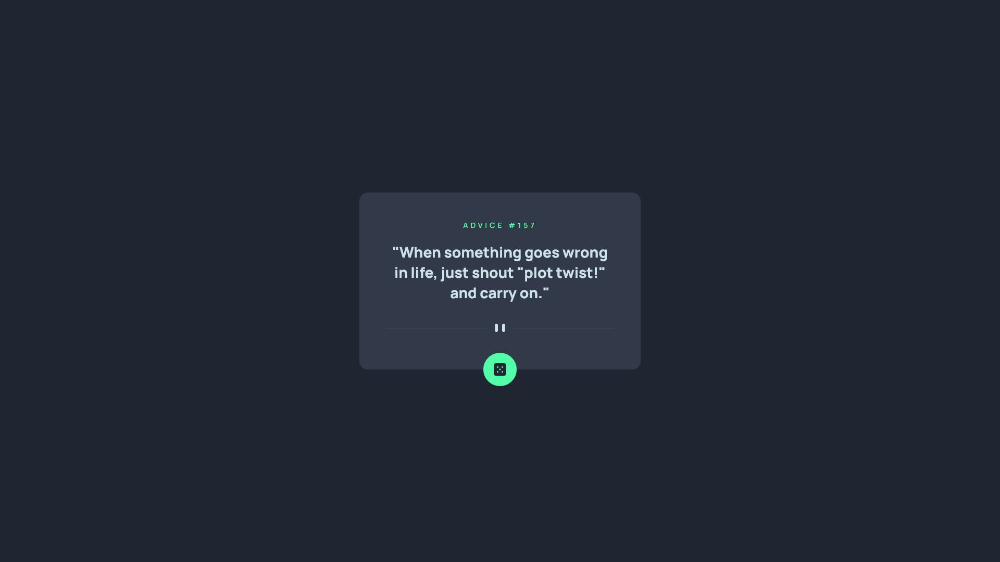

# Frontend Mentor - Advice generator app solution

This is a solution to the [Advice generator app challenge on Frontend Mentor](https://www.frontendmentor.io/challenges/advice-generator-app-QdUG-13db). Frontend Mentor challenges help you improve your coding skills by building realistic projects.

## Table of contents

- [Overview](#overview)
  - [Screenshot](#screenshot)
  - [Links](#links)
- [My process](#my-process)
  - [Built with](#built-with)
  - [What I learned](#what-i-learned)
- [Author](#author)

## Overview

Hi! This is my attempt at the Advice Generator App solution. This was my first time doing an API fetch in a Frontend Mentor project, but the challenge itself was fairly simple and straightforward. I completed the challenge in HTML, CSS and pure Javascript, but I plan to do a future iteration of this project in React.

Although the API documentation states that the advice is cached for 2 seconds, I found that the advice wasn't changing even after calling a successful fetch after more than 2 seconds. Thus, I had to pass `no-store` as a parameter in the fetch call.

### Screenshot

Desktop

Mobile

### Links

- Solution URL: [Here!](https://github.com/sheronimo/frontendmentor-advicegenerator)
- Live Site URL: [Here!](https://sheronimo.github.io/frontendmentor-advicegenerator/)

## My process

1. I first imported the design images into Photoshop and then sketched out the different element and font sizes, padding and margin units.
2. I then restructured the markup and worked on the styling.
3. After fine-tuning the styling, I then worked on the Javascript for fetching the API.
4. I added further enhancements, such as disabling the button for 2 seconds to prevent too many API calls within a short time.

### Built with

- Semantic HTML5
- Flexbox
- Javascript (fetch)

### What I learned

I learned about how to run fetch API calls and also hook them to an event listener on an element on the page.

## Author

- Github - [sheronimo](https://github.com/sheronimo)
- Frontend Mentor - [@sheronimo](https://www.frontendmentor.io/profile/sheronimo)
